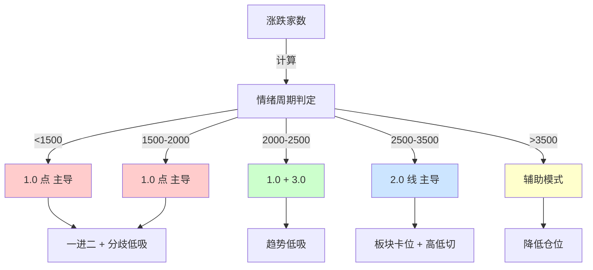
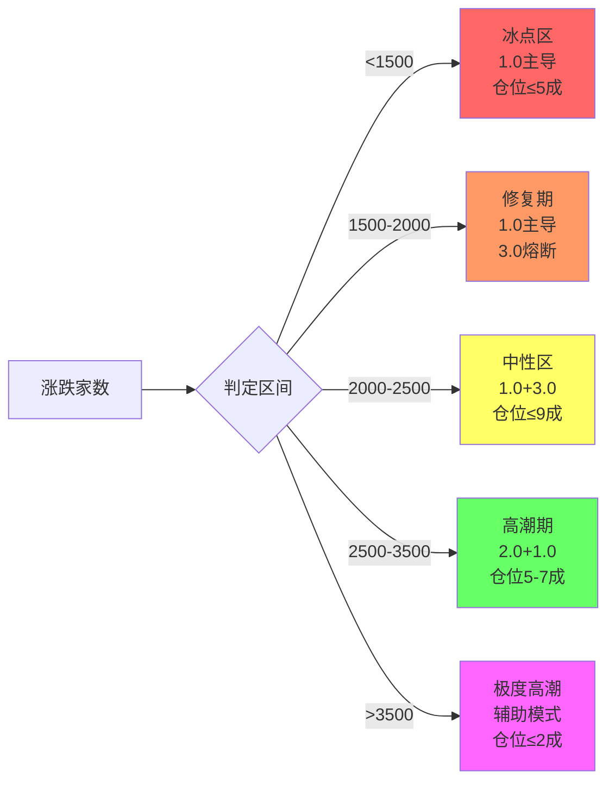
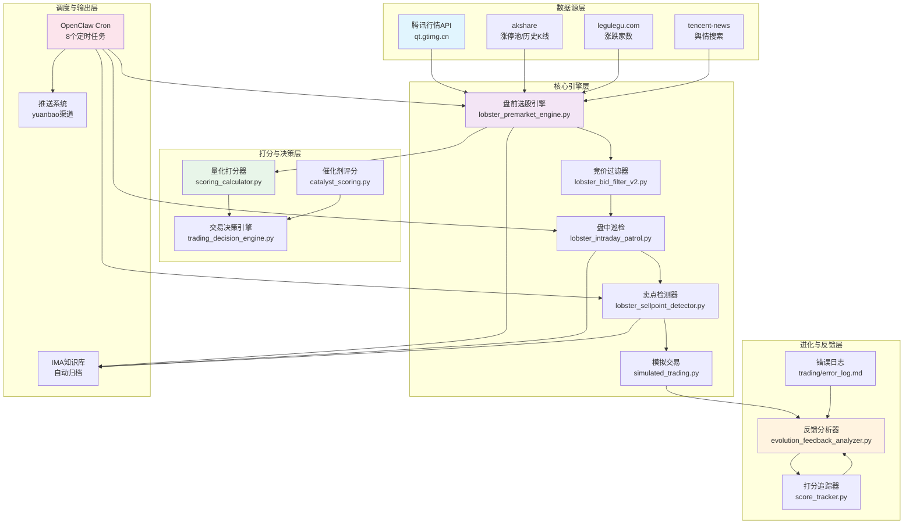
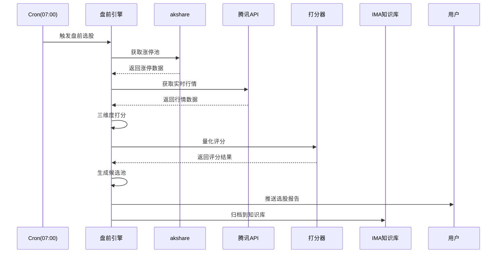
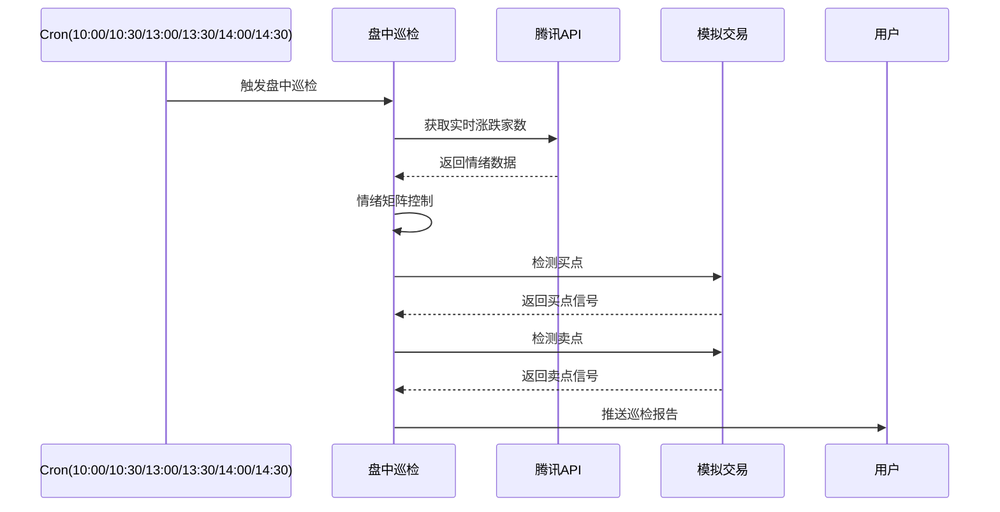
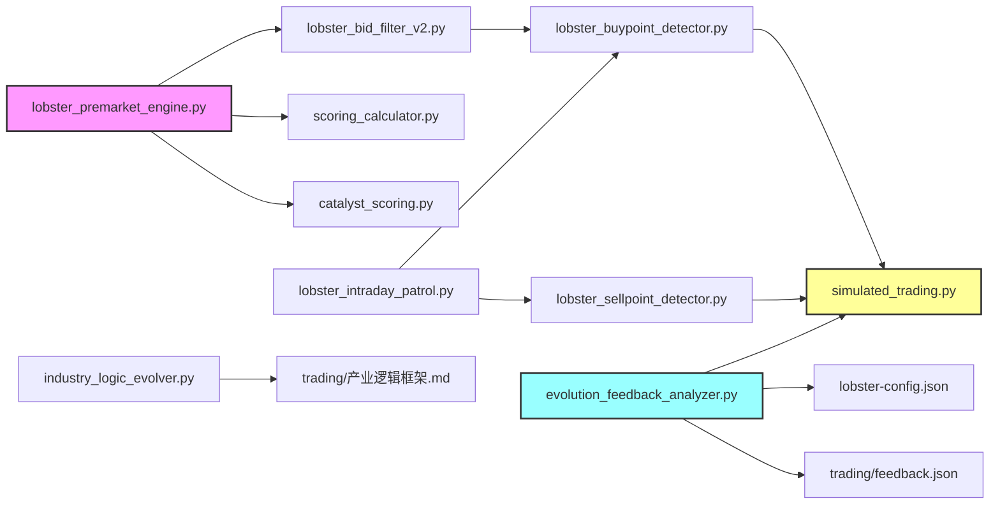
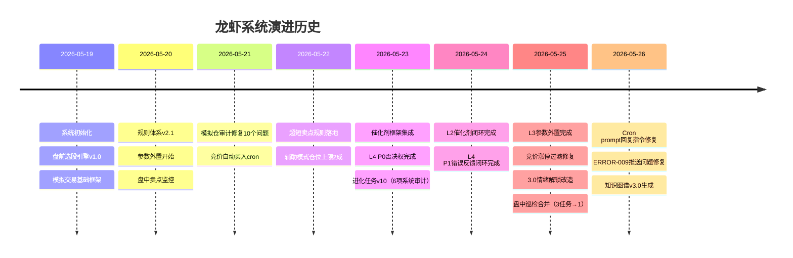

# 🦞 龙虾超短交易系统 — 知识图谱 v3.0

> **生成时间**：2026-05-26 19:30  
> **系统版本**：v2.4（规则体系）+ v1.5（配置版本）  
> **作者**：市场追踪专家（AI Agent）  
> **目标读者**：接手系统的开发者、需要快速理解架构的人

---

## 📋 目录

1. [系统概述](#系统概述)
2. [三维度框架](#三维度框架)
3. [系统架构图](#系统架构图)
4. [数据流图](#数据流图)
5. [Cron任务调度](#cron任务调度)
6. [模块依赖关系](#模块依赖关系)
7. [文件结构](#文件结构)
8. [关键配置](#关键配置)
9. [系统演进历史](#系统演进历史)
10. [已知问题清单](#已知问题清单)
11. [快速上手](#快速上手)

---

## 系统概述

**龙虾超短交易系统**是一个基于**三维度框架（点·线·面）**的A股自动化交易辅助系统。

### 核心能力

| 能力 | 说明 |
|------|------|
| 📊 市场监控 | 实时追踪大盘走势、板块轮动、涨跌家数 |
| 🎯 选股引擎 | 三维度打分模型，自动筛选候选标的 |
| 💰 模拟交易 | 全自动模拟盘，验证策略有效性 |
| 🧠 自我进化 | 基于交易反馈自动调整打分权重 |
| 📚 知识管理 | 自动归档复盘报告到IMA知识库 |

### 技术栈

- **语言**：Python 3.x + Bash
- **数据源**：腾讯行情API + akshare + legulegu.com
- **调度**：OpenClaw Cron
- **知识库**：IMA（腾讯内部知识管理系统）
- **配置**：lobster-config.json（v1.5）

---

## 三维度框架

系统的核心选股逻辑，基于**市场情绪（涨跌家数）**动态切换策略。

### 维度说明



### 三维度对比表

| 维度 | 名称 | 核心逻辑 | 适用情绪 | 仓位上限 | 单只仓位 |
|------|------|---------|---------|---------|---------|
| **1.0** | 点（打板） | 一进二 + 分歧低吸 | <2000 主导（含1500-2000）¹ | 5成 | 10万 |
| **2.0** | 线（板块轮动） | 板块卡位 + 高低切 | 2500-3500 主导 | 7成 | 10万 |
| **3.0** | 面（容量趋势） | 产业逻辑 + 趋势低吸 | 2000-2500 辅助² | 9成（合计） | 15万 |

**脚注：**
1. 1500-2000区间1.0主导但3.0熔断，不启用趋势低吸
2. 真正启用3.0需连续2日涨跌家数>2500

### 情绪矩阵（config v1.5）



---

## 系统架构图



---

## 数据流图

### 盘前选股数据流



### 盘中巡检数据流



---

## Cron任务调度

### 完整调度表

```mermaid
gantt
    title 龙虾系统Cron任务调度（交易日）
    dateFormat HH:mm
    axisFormat %H:%M
    
    section 盘前阶段
    盘前选股 :crit, 07:00, 30m
    竞价选股 :crit, 09:25, 5m
    竞价自动买入 :crit, 09:26, 5m
    
    section 盘中阶段
    情绪快检 :active, 09:45, 5m
    盘中巡检 :active, 10:00, 30m
    盘中巡检 :active, 10:30, 30m
    午间复盘 :crit, 11:30, 30m
    盘中巡检 :active, 13:00, 30m
    盘中巡检 :active, 13:30, 30m
    盘中巡检 :active, 14:00, 30m
    
    section 尾盘阶段
    盘中巡检 :crit, 14:30, 30m
    尾盘专项 :crit, 14:45, 15m
    收盘复盘 :crit, 15:05, 30m
    
    section 夜间阶段
    每日进化 :crit, 00:10, 60m
```



### Cron任务详情

| 任务ID | 任务名 | 时间 | 频率 | 超时 | 说明 |
|--------|--------|------|------|------|------|
| f2be7b01 | 龙虾盘前选股 | 07:00 | 每日 | 300s | 生成候选池 |
| 6ef5aaac | 龙虾竞价自动买入 | 09:26 | 每日 | 120s | 自动买入 |
| 93bdca91 | 龙虾盘中巡检 | 10:00-14:30 | 每30min | 120s | 买卖点监控 |
| e8fb44c9 | 龙虾情绪快检 | 09:45 | 每日 | 60s | 情绪快检 |
| - | 龙虾午间复盘 | 11:30 | 每日 | 300s | 午间总结 |
| ddb74ffd | 龙虾尾盘专项 | 14:45 | 每日 | 120s | 尾盘定调 |
| - | 龙虾收盘复盘 | 15:05 | 每日 | 600s | 收盘总结 |
| 9a560f0a | 龙虾每日进化优化 | 00:10 | 每日 | 600s | 参数调优 |

---

## 模块依赖关系



### 核心模块说明

| 模块 | 路径 | 功能 | 依赖 |
|------|------|------|------|
| 盘前引擎 | `scripts/lobster_premarket_engine.py` | 选股主引擎 | akshare, config |
| 竞价过滤 | `scripts/lobster_bid_filter_v2.py` | 竞价阶段过滤 | config |
| 盘中巡检 | `scripts/lobster_intraday_patrol.py` | 统一巡检 | 腾讯API |
| 买点检测 | `scripts/lobster_buypoint_detector.py` | 检测买入信号 | config |
| 卖点检测 | `scripts/lobster_sellpoint_detector.py` | 检测卖出信号 | config |
| 模拟交易 | `scripts/simulated_trading.py` | 模拟盘核心 | - |
| 打分器 | `scripts/scoring_calculator.py` | 量化打分 | config |
| 催化剂评分 | `scripts/catalyst_scoring.py` | 催化剂评分 | config |
| 进化分析器 | `scripts/evolution_feedback_analyzer.py` | 自我进化 | feedback.json |

---

## 文件结构

```
workspace-1gwpiwf3hr163jz5/
├── AGENTS.md                          # 系统身份与核心规则
├── SOUL.md                            # 人格与语气
├── USER.md                            # 用户信息
├── MEMORY.md                          # 长期记忆
├── TOOLS.md                           # 数据源速查
├── HEARTBEAT.md                      # 心跳系统规则
├── lobster-rules.md                   # 三维度选股硬约束
├── lobster-config.json                # 系统配置（v1.5）
│
├── scripts/                           # Python脚本
│   ├── lobster_premarket_engine.py    # 盘前选股引擎
│   ├── lobster_bid_filter_v2.py      # 竞价过滤器
│   ├── lobster_buypoint_detector.py   # 买点检测器
│   ├── lobster_sellpoint_detector.py  # 卖点检测器
│   ├── lobster_intraday_patrol.py     # 盘中巡检
│   ├── scoring_calculator.py          # 量化打分器
│   ├── catalyst_scoring.py            # 催化剂评分
│   ├── evolution_feedback_analyzer.py # 进化分析器
│   ├── simulated_trading.py           # 模拟交易
│   ├── industry_logic_evolver.py      # 产业逻辑进化
│   ├── lobster_backtest.py            # 回测工具
│   ├── lobster_trend_pool_updater.py  # 趋势池更新
│   ├── trading_decision_engine.py     # 交易决策引擎
│   ├── score_tracker.py               # 打分追踪
│   ├── normalize_sector_name.py       # 板块名标准化
│   ├── update_sector_status.py        # 板块状态更新
│   ├── trading_calendar.py            # 交易日判断
│   ├── blog_auto_writer.py            # 博客自动写作
│   ├── wechat_publisher.py            # 微信公众号发布
│   ├── enrich_candidates_with_news.py # 新闻 enrichment
│   └── ima_sync.sh                   # IMA同步脚本
│
├── scripts/cron-tasks/                # Cron任务Prompt
│   ├── CRON_PREMARKET_TASK.md         # 盘前选股
│   ├── CRON_BID_AUTO_BUY.md          # 竞价自动买入
│   ├── CRON_INTRADAY_PATROL_TASK.md  # 盘中巡检
│   ├── CRON_MIDDAY_TASK.md           # 午间复盘
│   ├── CRON_CLOSING_TASK.md          # 收盘复盘
│   ├── CRON_DAILY_EVOLUTION_TASK.md  # 每日进化
│   ├── CRON_EARLY_EMOTION_TASK.md    # 情绪快检
│   ├── CRON_CATALYST_COLLECTOR_TASK.md # 催化剂采集
│   ├── CRON_VERIFY_RULES_TASK.md     # 规则校验
│   └── CRON_BID_TASK.md              # 竞价选股
│
├── trading/                           # 交易相关文件
│   ├── 关注股.md                      # 当前关注标的
│   ├── 趋势容量池.md                   # 3.0维度标的池
│   ├── 选股历史.md                    # 历史选股记录
│   ├── 交易追踪.md                    # 持仓追踪
│   ├── 模拟持仓.json                  # 模拟持仓数据
│   ├── 系统状态.json                  # 系统状态
│   ├── feedback.json                  # 反馈数据
│   ├── error_log.md                  # 错误日志
│   ├── trade_errors.json             # 交易错误
│   ├── 催化日历.md                    # 催化剂日历
│   ├── 催化剂数据库.json               # 催化剂数据
│   ├── 产业逻辑框架.md                 # 产业逻辑
│   ├── heartbeat-rules-full.md        # 心跳规则完整版
│   ├── 复盘模板.md                    # 复盘模板
│   ├── 复盘数据库.xlsx                # 复盘Excel
│   ├── 交易日历.md                    # 交易日历
│   ├── sector_name_mapping.json       # 板块名映射
│   └── reports/                      # 报告目录
│
├── memory/                            # 记忆文件
│   ├── 2026-05-26.md                # 今日记忆
│   ├── 2026-05-25.md                # 昨日记忆
│   ├── template.md                   # 记忆模板
│   └── ...                           # 历史记忆
│
└── lobster_knowledge_graph_v3.md     # 本文档
```

---

## 关键配置

### lobster-config.json 结构

```json
{
  "_meta": {
    "version": "1.5",
    "last_updated": "2026-05-26",
    "desc": "龙虾选股系统配置"
  },
  
  "emotion": {
    // 情绪矩阵配置
    "below_1500": {"dim": "1.0", "pos_limit": 5},
    "1500_2000": {"dim": "1.0", "pos_limit": 5},
    "2000_2500": {"dim": "1.0", "aux": "3.0", "pos_limit": 9},
    "2500_3500": {"dim": "2.0", "aux": "1.0", "pos_limit": 7},
    "above_3500": {"dim": "辅助", "pos_limit": 2}
  },
  
  "1.0_first_to_second": {
    // 一进二配置
    "top_n": 7,
    "min_amount_wan": 1000,
    "max_amount_wan": 8000
  },
  
  "1.0_divergence": {
    // 分歧低吸配置
    "top_n": 4,
    "min_lb": 2,
    "max_lb": 3
  },
  
  "2.0_sector": {
    // 板块卡位配置
    "top_n": 3,
    "confirm_morning": {"min_zt_count": 2},
    "confirm_full_day": {"min_zt_count": 3}
  },
  
  "3.0_trend": {
    // 趋势低吸配置
    "top_n": 3,
    "required_aux": "3.0"
  },
  
  "catalyst": {
    // 催化剂配置
    "scoring_weights": {
      "fact_strength": 0.25,
      "expectation_diff": 0.3,
      "heat": 0.1,
      "payoff_period": 0.2,
      "tradability": 0.15
    }
  },
  
  "scoring_models": {
    // 打分模型权重（可进化）
    "1.0_first_to_second": {...},
    "1.0_divergence": {...},
    "2.0_sector": {...},
    "3.0_trend": {...}
  },
  
  "bid_filter_thresholds": {
    // 竞价过滤阈值
    "1.0_first_to_second": {"max_change_pct": 9.5},
    "2.0_sector": {"max_change_pct": 9.5}
  }
}
```

### 配置文件版本历史

| 版本 | 日期 | 变更内容 |
|------|------|---------|
| v1.0 | 2026-05-19 | 初始版本 |
| v1.1 | 2026-05-20 | 新增`3.0_emotion_rules` |
| v1.2 | 2026-05-23 | 新增`catalyst`配置块 |
| v1.3 | 2026-05-25 | 参数外置完成（`scoring_models`/`bid_filter_thresholds`） |
| v1.4 | 2026-05-25 | 进化任务自动调参（top_n/score） |
| v1.5 | 2026-05-26 | 情绪矩阵完善（1500-2000区间） |

---

## 系统演进历史



### 重大设计决策

| 决策 | 时间 | 理由 | 影响 |
|------|------|------|------|
| 催化剂用PnL代理判定兑现 | 2026-05-24 | 不修改评分器本体 | L2闭环完成 |
| 情绪解锁用「带锁生成+运行时判定」 | 2026-05-25 | 解决辅助模式无候选问题 | 3.0维度可用性大幅提升 |
| 进化任务直接改config | 2026-05-25 | 用户要求全自动闭环 | 参数驱动进化落地 |
| Cron prompt加回复指令 | 2026-05-26 | 解决推送丢失问题 | 所有cron任务推送恢复正常 |

---

## 已知问题清单

### 按优先级排序

| 优先级 | 问题 | 状态 | 影响 | 修复计划 |
|--------|------|------|------|---------|
| **P0** | ERROR-002 腾讯API字段索引 | ✅ 已修复 | 行情数据错误 | 已修复p[4]→p[3] |
| **P0** | ERROR-001 buy()参数位置 | ✅ 已修复 | 买入失败 | 已修复参数顺序 |
| **P1** | ERROR-009 cron推送丢失 | ✅ 已修复，待当日验证 | 用户收不到推送 | 已加回复指令，待10:00/15:05验证 |
| **P1** | L1反馈机制缺失 | ❌ 未启动 | 无法验证情绪预测 | 需记录预测vs实际 |
| **P2** | L4 P2动态仓位未完成 | ❌ 未启动 | 仓位管理不够精细 | 需实现动态调整 |
| **P2** | L4 P3执行反馈未完成 | ❌ 未启动 | 执行质量无评估 | 需实现执行反馈 |
| **P3** | legulegu.com解析兼容 | ⚠️ 待修复 | 情绪数据获取失败 | 改用gawk或python |
| **P3** | 创业板涨停阈值 | ⚠️ 待优化 | 20%涨停股可能漏筛 | 需分市场设置阈值 |

### 问题详情

#### ERROR-002 腾讯API字段索引错误

- **现象**：亨通光电(600487)价格显示错误
- **原因**：`p[4]`是昨收价，现价应是`p[3]`
- **修复**：2026-05-26 11:54 修复
- **验证**：待明天盘中巡检验证

#### ERROR-009 cron推送丢失

- **现象**：盘中巡检/收盘复盘用户收不到
- **原因1**：delivery配置有`direct:`前缀 → ✅ 已修复
- **原因2**：cron prompt缺少回复指令 → ✅ 已修复（11个文件全部加上）
- **验证**：待明天10:00/15:05验证

#### L1反馈机制缺失

- **现象**：情绪阈值已在config，但缺反馈机制
- **影响**：无法验证情绪预测准确率，无法自我优化
- **修复计划**：
  1. 在`trading/feedback.json`新增`L1_emotion`字段
  2. 记录每日情绪预测（盘前）vs 实际（收盘）
  3. 进化任务根据准确率调整阈值

---

## 快速上手

### 新手入门

1. **理解三维度框架**：读`AGENTS.md`的「三维度框架」章节
2. **熟悉数据流**：看本文档的「数据流图」章节
3. **跑通盘前选股**：手动执行`python3 scripts/lobster_premarket_engine.py`
4. **查看模拟持仓**：读`trading/模拟持仓.json`
5. **理解进化机制**：读`scripts/evolution_feedback_analyzer.py`

### 开发者指南

#### 修改选股逻辑

1. 修改`lobster-config.json`的对应配置块
2. 不要直接改Python代码（除非bug修复）
3. 进化任务会自动调整权重，无需手动干预

#### 添加新维度

1. 在`lobster-config.json`新增维度配置
2. 在`scripts/lobster_premarket_engine.py`新增选股函数
3. 在`scripts/scoring_calculator.py`新增打分逻辑
4. 在CRON任务Prompt中新增步骤

#### 调试Cron任务

1. 手动触发：`openclaw cron run <task_id>`
2. 查看执行状态：`openclaw cron list`
3. 查看会话记录：`sessions_list --kinds isolated`
4. 检查推送配置：`openclaw cron show <task_id> | grep delivery`

### 常用命令速查

```bash
# 查看所有cron任务
openclaw cron list

# 手动触发任务
openclaw cron run 93bdca91-d49b-423e-b9cd-02a7fe091d6a

# 查看任务详情
openclaw cron show f2be7b01-76d7-441d-8dd0-5113e35435dd

# 修改任务推送配置
openclaw cron edit <task_id> --to "Y4oPshFZbMiblavrV+kZZdcSD5YFmAiKomnSLvNDINcwVFC1HLHzx5qq7AG0zjPq"

# 查看isolated会话
sessions_list --kinds isolated --limit 5

# 读取记忆文件
cat memory/2026-05-26.md

# 查看模拟持仓
cat trading/模拟持仓.json | python3 -m json.tool

# 关键字段说明（消除歧义）
# total_assets: 总资产 = available_cash + market_value（可用现金 + 持仓市值）
# profit_pct: 累计盈亏百分比 = (total_assets - 1000000) / 1000000 × 100%

# 执行盘前选股
python3 scripts/lobster_premarket_engine.py

# 执行盘中巡检
python3 scripts/lobster_intraday_patrol.py

# 执行进化分析
python3 scripts/evolution_feedback_analyzer.py
```

---

## 附录

### 数据源详解

| 数据 | 方法 | 频率 | 备注 |
|------|------|------|------|
| 指数实时行情 | 腾讯API `qt.gtimg.cn` | 实时 | GBK2312编码，需转UTF-8 |
| 个股实时行情 | 腾讯API `qt.gtimg.cn` | 实时 | 同上 |
| 涨跌家数 | legulegu.com | 实时 | 非交易时段格式有差异 |
| 涨停池 | akshare `stock_zt_pool_em` | 日终 | 盘后更新 |
| 历史K线 | akshare `stock_zh_a_hist` | 日终 | 用于计算均线 |
| 板块涨幅 | akshare `stock_board_industry_name_em` | 实时 | - |
| 舆情新闻 | tencent-news技能 | 盘前 | - |

### 配置文件读取示例

```python
import json

with open('/Users/yuefengshen/.qclaw/workspace-1gwpiwf3hr163jz5/lobster-config.json') as f:
    config = json.load(f)

# 读取情绪矩阵
emotion_config = config['emotion']['2500_3500']
dim = emotion_config['dim']  # "2.0"
pos_limit = emotion_config['pos_limit']  # 7

# 读取一进二配置
f2s_config = config['1.0_first_to_second']
top_n = f2s_config['top_n']  # 7
min_amount = f2s_config['min_amount_wan']  # 1000
```

### 推送配置格式

```
# 正确格式（用户能收到）
announce -> yuanbao:Y4oPshFZbMiblavrV+kZZdcSD5YFmAiKomnSLvNDINcwVFC1HLHzx5qq7AG0zjPq

# 错误格式1（有direct:前缀，可能导致收不到）
announce -> yuanbao:direct:Y4oPshFZbM...

# 错误格式2（双重前缀，肯定收不到）
announce -> yuanbao:yuanbao:Y4oPshFZb...
```

---

## 总结

**龙虾超短交易系统**是一个：
- ✅ **数据驱动**的系统（不预测，只呈现数据）
- ✅ **自我进化**的系统（基于反馈自动调参）
- ✅ **风险优先**的系统（五道否决权 + 硬止损）
- ⚠️ **还在完善**的系统（L1/L4 P2 P3待实现）

**下一步重点**：
1. 验证ERROR-009修复效果（明天10:00/15:05）
2. 实现L1反馈机制
3. 完成L4 P2/P3
4. 优化创业板涨停阈值

---

**文档版本**：v3.0  
**最后更新**：2026-05-26 19:30  
**作者**：市场追踪专家（AI Agent）  
**联系方式**：通过OpenClaw YuanBao渠道
